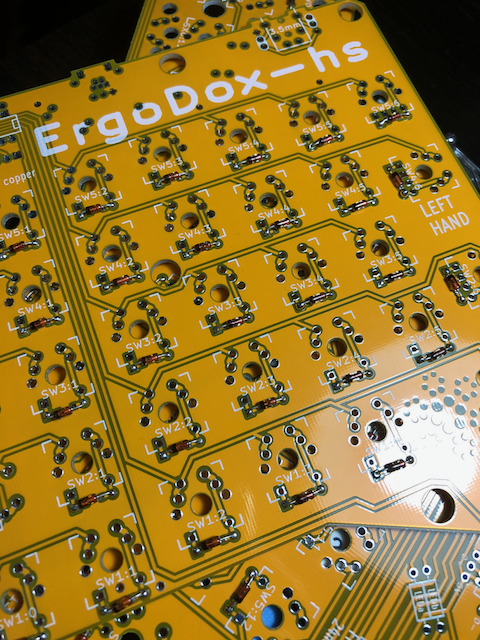
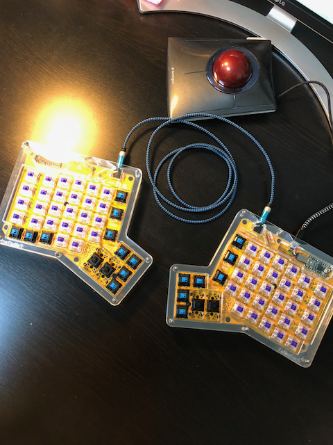

# ergpdpx-pcb-hs-cherry

Holtite Socket対応版Ergodox PCBデータです。  
以下のリポジトリを元に変更しています。

https://github.com/bishboria/ErgoDox

# はじめに
はんだ付け無しでキースイッチとTeensy2を設置できる基板です。
IOエキスパンダと各種抵抗、I/Fは対応していません。

なお、実際に組み立てて動作するところは確認していますが、LEDは趣味ではないのでLED点灯のみ動作確認をしていません。

## 対応Holtite Socket
以下のどちらかに対応しています。

- [8134-HC-8P2](http://www.te.com/jpn-ja/product-7-1437514-0.html)  
- [8134-HC-8P3](http://www.te.com/jpn-ja/product-7-1437514-1.html)

## 必要な部品
|パーツ|リンク|量|
|:---|:---|:---|
|PCB|	-	|2|
|Teensy USB Board, Version 2.0|http://www.pjrc.com |1|
|MCP23018 I/O expander|Digikey: MCP23018-E/SP-ND|1|
|3.5mm TRRS connector|Digikey: CP-43514-ND|2|
|USB mini B connector|Digikey: WM17115-ND|1|
|USB mini B plug|Digikey: H2955-ND|1|
|0.1 UF ceramic capacitor|Digikey: BC2665CT-ND*|1|
|1N4148 diode   (SOD-123 package (SMD), or DO-35 (through hole 0.3" pitch))|Digikey: 1N4148FS-ND* or Digikey: 1N4148W-FDICT-ND*	|76-80|
|2.2K Ω resistor|Digikey: 2.2KQTR-ND*|2|
|3mm T1 LED|Digikey: 160-1034-ND*| |
|220 Ω resistor (match to led)	|Digikey: 220QBK-ND*|3|
|Cherry MX switch|Mouser: MX1A-*****|76-80|
|USB cable Male A to male mini B|USBFirewire: www.usbfirewire.com*|	1|
|TRRS cable	|MyCableMart: www.mycablemart.com*|1|
|holtite|Digikey:A114359-ND or A114358-ND| (152-160) + 24|

## PCBの入手方法
ご自身でGerberファイルを生成し、PCBGOGO等の基盤制作業者にご依頼ください。

# 実装

組み立て方法は通常のErgodoxと変わりません。HoltiteSocketをスルーホールに圧着するところが通常版との違いになります。

## Holtite socketの圧着方法
下記動画を参考にしてください。

## 取付時の注意点
以下を参照

### IOエキスパンダははんだ付けする
IOエキスパンダを取り付けるスルーホールはHoltiteSocket適合サイズに変更していますが、IOエキスパンダの脚が細すぎて適合しません。

HoltiteSocketは利用せず、通常通り半田付けしてください。

### Falbatechのアクリルキースイッチプレートを利用した場合の適合表

Falbatechのアクリルケースについているスイッチプレートを使用した場合、厚みによりMX互換品のキースイッチでも高さが足りずに接触できない種類のものが有りました。
メタルのスイッチプレートを利用している方はどのスイッチでも使えると思います。

|メーカー|種類|結果|
|:---|:---|:---|
|CheeryMX|黒軸|OK|
||青軸|OK|
||赤軸|OK|
|ZealPC|R9 Purple Zealio Switches|OK|
|Kaihua|Kailh Speed Switches|NG|

# Special Thanks
[haru-akeさんの HoltiteSocket対応版Let'sSplit](https://github.com/haru-ake/lets-split-pcb-hs-cherry)のPCBを頂いたことから本プロジェクトが始まりました。
